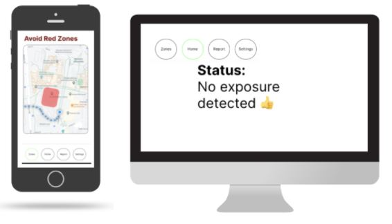
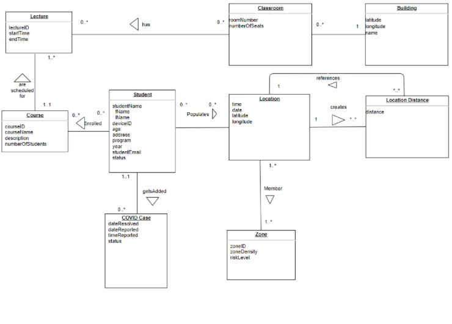

# Covid Tracking Application
>
> 

This application will be a safety guide for students at UWO, monitoring the pandemic and keeping students informed through regular updates. It would maintain the safety of the student population by tracking positive cases, alerting users who might have had contact with them. Furthermore, the University campus will be sectioned into zones—safe, denoted by green and unsafe, denoted by red—to help users decide which areas or paths they would like to use. Overall, the application would ensure a safe return to campus with a preventative solution in addition to one that is simply reactive.

The database is hosted on AWS RDS in a MySQL database

> 

The frontend would allow admins to udpate users to infected, which would allow users to perform contact tracing.

##### First SQL database app is now
- [ ] Started
- [ ] In progress
- [x] Complete

[Additional Information found here :)](https://docs.google.com/document/d/1YaBXHer-vq4s93-e8aOlUPx0M6-vDPe1kSAphw2IGYE/edit?usp=sharing)

